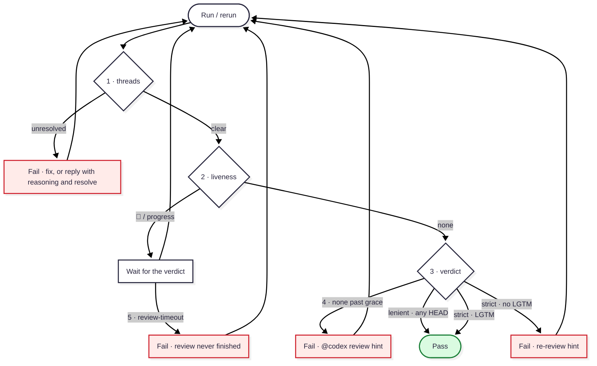

# Codex Review Check

<p align="center">
  
</p>

Codex Review Check is a read-only, credit-aware GitHub Action that guides agents through the Codex review loop: a completed review holds the quality floor by default, and `require-lgtm: true` raises the bar to a current-HEAD Codex LGTM.

## Installation

1. Copy the ready-to-use [`examples/codex-review-check.yml`](examples/codex-review-check.yml) into the consuming repository as `.github/workflows/codex-review-check.yml`. The example pins the Action to a reviewed full commit SHA and grants only read permissions.
2. Enable Codex code review for the repository with the **On pull request** trigger, so each pull request receives an initial review.

## Usage

Open or update a pull request, then watch the normal check interface:

```shell
gh pr checks --watch
```

When `gh pr checks` reports a failure, the failure log line gives the agent one concrete next action and keeps review-credit decisions explicit:

```console
$ gh run view --log-failed
...
##[error]No Codex review signal for current HEAD 821c759c9c3256e8a677800dbe8e4a88ae5e2ab0. Run: gh pr comment 42 --body '@codex review' — then re-run: gh run rerun 33499862152 --failed
```

The job summary mirrors the same guidance in the web UI for human debugging.

The initial review only covers the first HEAD. When a later push needs another review, the failure prints the explicit request command — `gh pr comment <PR> --body '@codex review'` — for the agent to run; the Action never spends Codex credits itself. By default a completed review passes once its threads are resolved; set `require-lgtm: true` to require a current-HEAD LGTM.

The check follows this state model — the loop over time:



And its evaluation order — each evaluation stops at the first match:

```text
1 · unresolved Codex threads    → fail · fix, or reply with reasoning and resolve
2 · a newer review is running   → wait (👀 / progress comment)
3 · completed verdict           → pass
      lenient (default):  latest verdict, any HEAD
      require-lgtm:       LGTM on the current HEAD — a verdict without an LGTM fails with a re-review hint
4 · nothing after grace-seconds → fail · @codex review hint
5 · review never finishes       → fail at review-timeout-seconds
```

## Configuration

See [configuration, outputs, and reruns](docs/CONFIGURATION.md).

## License

[Apache License 2.0](LICENSE)
