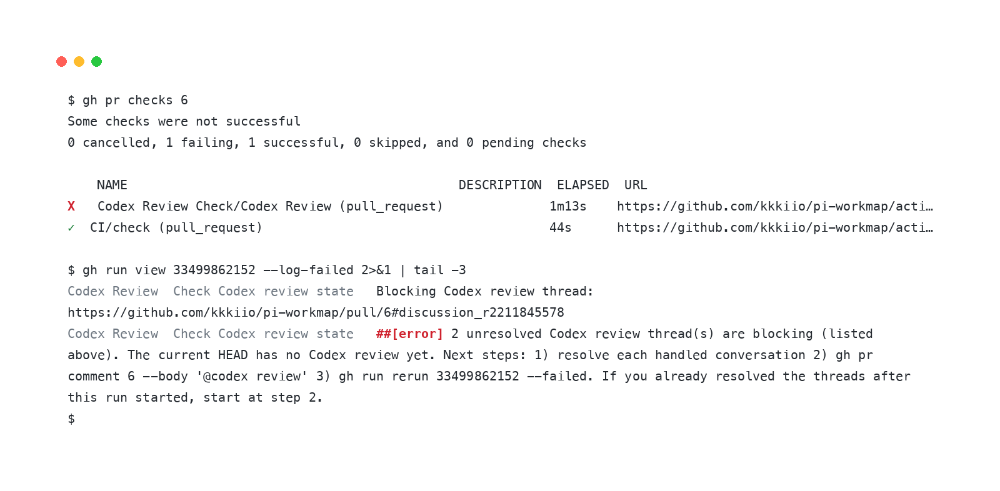

# Codex Review Check

<p align="center">
  
</p>

Codex Review Check is a read-only, credit-aware GitHub Action that guides agents through the Codex review loop: a completed review holds the quality floor by default, and `require-lgtm: true` raises the bar to a current-HEAD Codex LGTM.

## Installation

Copy the ready-to-use [`examples/codex-review-check.yml`](examples/codex-review-check.yml) into the consuming repository as `.github/workflows/codex-review-check.yml`. The example pins the Action to a reviewed full commit SHA and grants only read permissions.

Enable Codex code review for the repository with the **On pull request** trigger so each pull request receives an initial review. The Action provides an explicit command when a later HEAD needs another review. By default, a completed review may pass without a current-HEAD LGTM; set `require-lgtm: true` for the strict gate.

After its first pull request run, add the `Codex Review` job as a required check in the repository ruleset.

## Usage

Open or update a pull request, then watch the normal check interface:

```shell
gh pr checks --watch
```

When `gh pr checks` reports a failure, the failure log line gives the agent one concrete next action and keeps review-credit decisions explicit:

```console
$ gh run view --log-failed
...
##[error]No Codex review signal for current HEAD 821c759c9c3256e8a677800dbe8e4a88ae5e2ab0. Run: gh pr comment 42 --body '@codex review' — then re-run: gh run rerun 33499862152 --failed
```

The job summary mirrors the same guidance in the web UI for human debugging.

The check follows this state model — each evaluation walks the chain and stops at the first match:

```text
1 · Unresolved Codex threads → fail: fix each finding — or reply with reasoning — then resolve
2 · A review started after the latest verdict is running (👀 / progress) → keep waiting
3 · Completed review evidence → pass
      lenient (default):    the latest completed verdict on any HEAD
      require-lgtm: true:   an LGTM (👍 / "Didn't find any major issues") on the current HEAD
4 · Strict only — a completed current-HEAD review without an LGTM → fail with a re-review hint
5 · No signal after grace-seconds → fail with the @codex review hint
6 · A review that never finishes → fail at review-timeout-seconds
```

Failures print the concrete next command in the job log; re-running the job re-evaluates live pull request state.

## Configuration

See [configuration, outputs, and reruns](docs/CONFIGURATION.md).

## License

[Apache License 2.0](LICENSE)
