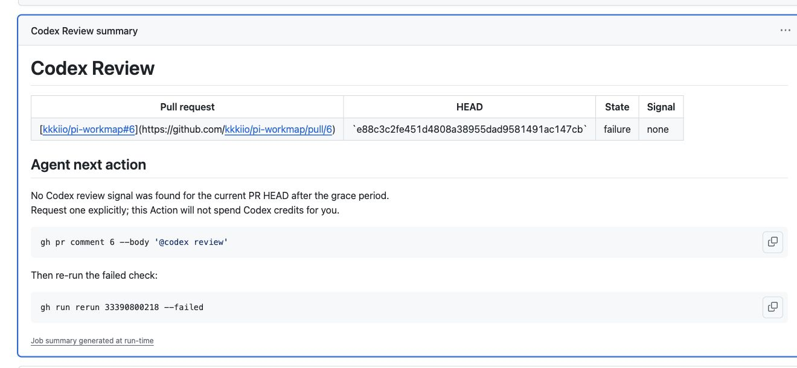

# Codex Review Check

<p align="center">
  <a href="https://github.com/kkkiio/pi-workmap/pull/6">
    
  </a>
</p>

Codex Review Check is a read-only, credit-aware GitHub Action that guides agents through the Codex review loop: it surfaces known findings first and provides an explicit command when the current HEAD needs another review.

## Installation

Copy the ready-to-use [`examples/codex-review-check.yml`](examples/codex-review-check.yml) into the consuming repository as `.github/workflows/codex-review-check.yml`. The example pins the Action to a reviewed full commit SHA and grants only read permissions.

Enable Codex code review for the repository with the **On pull request** trigger so each pull request receives an initial review. The Action provides an explicit command when a later HEAD needs another review.

After its first pull request run, add the `Codex Review` job as a required check in the repository ruleset.

## Usage

Open or update a pull request, then watch the normal check interface:

```shell
gh pr checks --watch
```

When `gh pr checks` reports a failure, the run summary gives the agent one concrete next action and keeps review-credit decisions explicit:

<p align="center">
  <a href="https://github.com/kkkiio/pi-workmap/actions/runs/33390800218">
    
  </a>
</p>

The check follows this state model:

| Current PR state | Result |
| --- | --- |
| Unresolved Codex review threads that block under the outdated policy | Fail first and link the blocking conversations |
| No current-HEAD Codex signal during the grace period | Fail with `gh pr comment <PR> --body '@codex review'` and rerun instructions |
| Current Codex 👀 or progress signal | Keep the job running/pending while polling |
| Terminal current-HEAD signal with no blocking threads | Succeed |
| Liveness without a terminal result before the review timeout | Fail with rerun instructions |

## Documentation

- [Configuration, outputs, and reruns](docs/CONFIGURATION.md)
- [Observed Codex GitHub signals](docs/CODEX_GITHUB_SIGNALS.md)
- [Source references and design differences](docs/REFERENCES.md)

## License

[Apache License 2.0](LICENSE)
